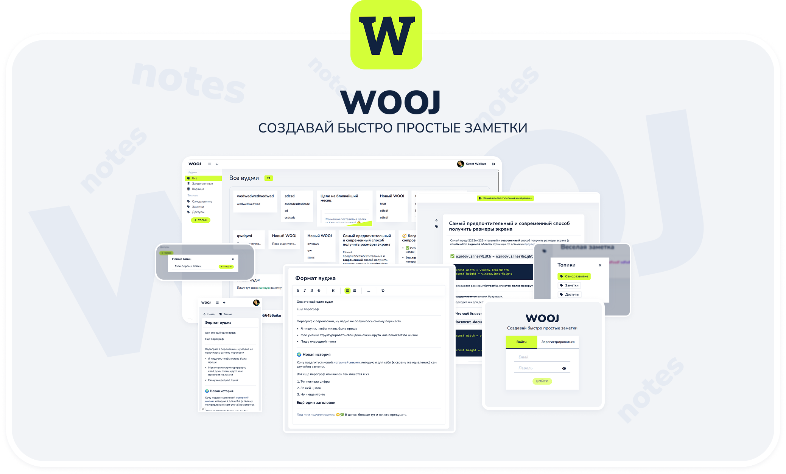
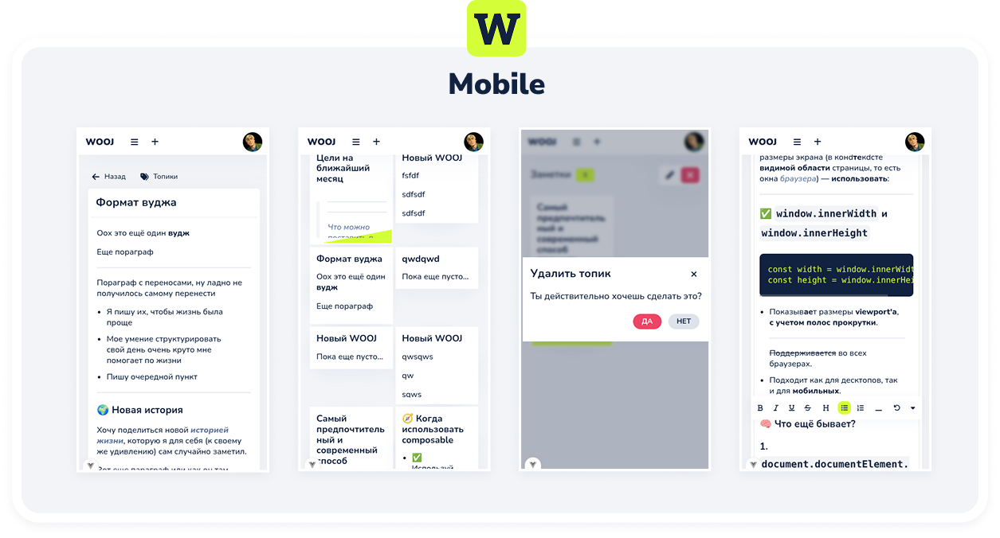

# WOOJ

Персональная система управления заметками с мощными возможностями организации и редактирования контента.


## 🚀 Описание проекта

**WOOJ** - это современное веб-приложение для создания, организации и управления личными заметками ("вуджами"). Система позволяет структурировать информацию через систему топиков, поддерживает rich-text редактирование и предоставляет интуитивный интерфейс для работы с контентом.

### ✨ Основные возможности

- 📝 **Создание и редактирование заметок** с rich-text редактором (TipTap)
- 🏷️ **Система топиков** для организации контента
- 📌 **Закрепление важных заметок**
- 🗂️ **Корзина** с возможностью восстановления
- 🔄 **Drag & Drop** для изменения порядка заметок
- 👤 **Система аутентификации** с верификацией email
- 🖼️ **Загрузка аватаров** пользователей
- 📱 **Адаптивный дизайн** для всех устройств



## 🏗️ Архитектура

Проект построен на микросервисной архитектуре с четким разделением frontend и backend:

```
wooj/
├── api/           # Laravel API сервер
├── front/         # Vue.js приложение
├── .docker/       # Docker конфигурации
└── etc/           # Дополнительные ресурсы
```

### Backend (Laravel 12)

- **API**: RESTful API с Laravel Sanctum для аутентификации
- **Модели**: User, Wooj, Topic, WoojTopic (связи многие-ко-многим)
- **База данных**: PostgreSQL с миграциями
- **Сервисы**: WoojService, TopicService, UserService для бизнес-логики

### Frontend (Vue.js 3)

- **Состояние**: Pinia stores для управления состоянием
- **Роутинг**: Vue Router с защищенными маршрутами
- **UI**: Bulma CSS + собственные компоненты
- **Редактор**: TipTap для rich-text редактирования

## 🛠️ Технологический стек

### Backend

- **Framework**: Laravel 12.x
- **PHP**: 8.4
- **Database**: PostgreSQL
- **Authentication**: Laravel Sanctum
- **Package**: Compoships для составных ключей

### Frontend

- **Framework**: Vue.js 3.5
- **Build Tool**: Vite 6.x
- **State Management**: Pinia 3.x
- **Routing**: Vue Router 4.x
- **Editor**: TipTap 2.x
- **Styles**: Bulma + SCSS
- **Icons**: Font Awesome
- **Additional**: Swiper.js, Lodash, Advanced Cropper

### DevOps

- **Containerization**: Docker & Docker Compose
- **Web Server**: Nginx
- **Mail**: MailHog для разработки

## 📦 Установка и запуск

### Предварительные требования

- Docker и Docker Compose
- Git

### Клонирование и запуск

```bash
# Клонировать репозиторий
git clone https://github.com/scottwalkerman/wooj.ru.git
cd wooj.ru

# Создать .env файл на основе .env.example
cp api/.env.example api/.env

# Настроить переменные окружения в .env

# Запустить контейнеры
docker-compose up -d

# Установить зависимости backend
docker-compose exec api composer install

# Выполнить миграции
docker-compose exec api php artisan migrate

# Установить зависимости frontend
docker-compose exec front npm install

# Запустить dev сервер frontend
docker-compose exec front npm run dev
```

### Доступные порты

- **Frontend (dev)**: http://localhost:5173
- **Frontend (build)**: http://localhost:8080
- **API**: http://localhost:7070
- **MailHog**: http://localhost:8025
- **Database**: localhost:5432

## 🗄️ Структура базы данных

### Основные таблицы

- **users**: Пользователи системы

  - id, name, email, password, avatar, email_verified_at

- **woojs**: Заметки (вуджи)

  - id, title, content, author_id, created_at, updated_at, deleted_at

- **topics**: Топики для организации

  - id, type, name, author_id, created_at, updated_at

- **woojs_topics**: Связь заметок и топиков
  - id, wooj_id, topic_id, position

### Типы топиков

- `all` - Все заметки
- `pinned` - Закрепленные заметки
- `public` - Публичные заметки
- `custom` - Пользовательские топики

## 🎯 API Endpoints

### Аутентификация

```
POST /api/register    # Регистрация
POST /api/login       # Вход
POST /api/logout      # Выход
GET  /api/check       # Проверка авторизации
POST /api/resend      # Повторная отправка письма
```

### Заметки (Woojs)

```
GET    /api/woojs              # Список заметок
POST   /api/woojs              # Создание заметки
GET    /api/woojs/{id}         # Получение заметки
PUT    /api/woojs/{id}         # Обновление заметки
DELETE /api/woojs/{id}         # Удаление в корзину
PUT    /api/woojs/{id}/restore # Восстановление
PUT    /api/woojs/{id}/pin     # Закрепление
PUT    /api/woojs/{id}/unpin   # Открепление
```

### Топики

```
GET    /api/topics           # Список топиков
POST   /api/topics           # Создание топика
PUT    /api/topics/{id}      # Обновление топика
DELETE /api/topics/{id}      # Удаление топика
PUT    /api/topics/{id}/sort # Сортировка заметок
```

## 🎨 Особенности UI/UX

### Дизайн

- Современный минималистичный интерфейс
- Темная и светлая темы (планируется)
- Адаптивная верстка для мобильных устройств
- Анимации и плавные переходы

### Компоненты

- **WoojCard**: Карточка заметки с превью
- **Editor**: Rich-text редактор с панелью инструментов
- **Sidebar**: Навигация по топикам
- **TopicTags**: Теги для быстрого доступа
- **Modal**: Модальные окна для форм

### Drag & Drop

- Перетаскивание заметок между топиками
- Изменение порядка заметок внутри топика
- Визуальная обратная связь при перетаскивании

## 🔧 Команды разработки

### Backend (Laravel)

```bash
# Войти в контейнер API
docker-compose exec api bash

# Artisan команды
php artisan migrate
php artisan tinker
php artisan make:model ModelName
php artisan make:controller ControllerName

# Composer
composer install
composer update
```

### Frontend (Vue.js)

```bash
# Войти в контейнер Frontend
docker-compose exec front bash

# NPM команды
npm run dev          # Запуск dev сервера
npm run build        # Сборка для продакшена
npm run preview      # Предварительный просмотр сборки
npm run format       # Форматирование кода
```

## 📚 Ресурсы и документация

### Backend

- [Laravel Documentation](https://laravel.com/docs/11.x)
- [Laravel Sanctum](https://laravel.com/docs/sanctum)

### Frontend

- [Vue.js](https://vuejs.org)
- [Vue Router](https://router.vuejs.org/)
- [Pinia](https://pinia.vuejs.org/)

### Стили и UI

- [Bulma CSS](https://bulma.io/documentation/)
- [Font Awesome](https://docs.fontawesome.com/web/setup/get-started)
- [Google Fonts](https://fonts.google.com/?lang=ru_Cyrl&script=Cyrl)

### Дополнительные библиотеки

- [TipTap Editor](https://tiptap.dev/docs/editor/getting-started/overview)
- [Swiper.js](https://swiperjs.com/element#usage)
- [Vue Advanced Cropper](https://advanced-cropper.github.io)
- [Draggable](https://shopify.github.io/draggable/)
- [Lodash](https://lodash.com/)

### Инструменты разработки

- [Sass Documentation](https://sass-lang.com/documentation/)
- [CSS Gradient Generator](https://cssgradient.io/)
- [Flexbox Guide](https://angrytools.com/css-flex/)

## 📝 Лицензия

Проект распространяется под [MIT License](LICENSE).

## 👨‍💻 Автор

**Scott Walker**

- GitHub: [@scottwalker](https://github.com/scottwalker)
- Project Link: [wooj.ru](https://github.com/scottwalker/wooj)
